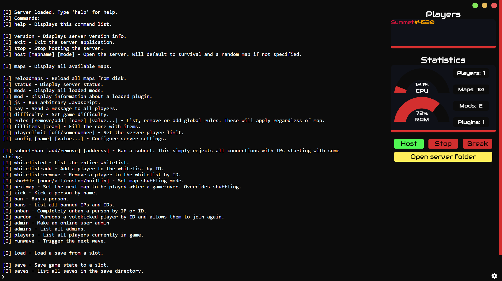

# Mindustry Server Console

An advanced control panel for [Mindustry](https://github.com/Anuken/Mindustry) server, built on [Electron](https://github.com/electron/electron).

## Preview

## Download

Download in _Mindustry Server Console_ in [releases](http://github.com/Summet-V/Mindustry-Server-Console/releases) page.

## Building

Open a terminal in the root directory, cd to the Mindustry folder and run the following commands:

_Running:_ `npm run dev`  
_Building:_ `npm build`

After building, the output _.exe_ file should be in `/release/Mindustry Server Console Setup [VERSION].exe` for setup.

## Support

Link to [Discord](https://discord.gg/zkmS8Y6) support server: https://discord.gg/zkmS8Y6.
